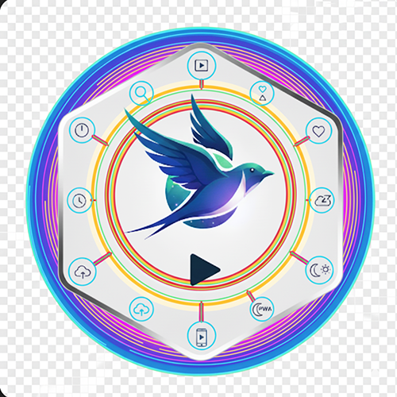
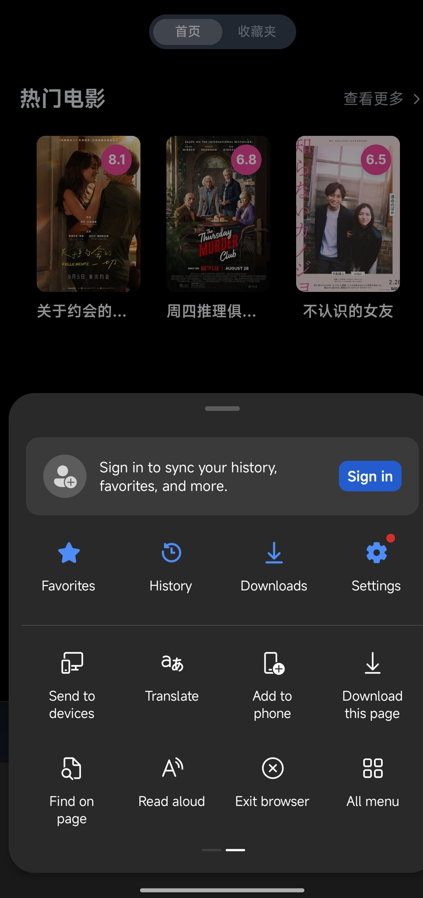

# 🎬 ShiYuTV

<div align="center">
  
  
  <div style="background: linear-gradient(135deg, rgba(102, 126, 234, 0.1) 0%, rgba(118, 75, 162, 0.1) 100%); padding: 32px; border-radius: 24px; margin: 24px 0; backdrop-filter: blur(10px);">
    <h1 style="margin: 0 0 12px 0; background: linear-gradient(135deg, #667eea 0%, #764ba2 100%); -webkit-background-clip: text; -webkit-text-fill-color: transparent; font-weight: 800; font-size: 2.5rem; letter-spacing: -0.02em;">
      开箱即用的跨平台影视聚合播放器
    </h1>
    <div style="height: 4px; width: 120px; background: linear-gradient(90deg, #667eea, #764ba2); border-radius: 2px; margin: 16px auto;"></div>
    <p style="color: #4B5563; font-size: 18px; margin: 0; max-width: 700px; line-height: 1.7; font-weight: 400;">
      基于 <span style="background: linear-gradient(135deg, #000000 0%, #333333 100%); -webkit-background-clip: text; -webkit-text-fill-color: transparent; font-weight: 700;">Next.js 14</span> + 
      <span style="background: linear-gradient(135deg, #06B6D4 0%, #3B82F6 100%); -webkit-background-clip: text; -webkit-text-fill-color: transparent; font-weight: 700;">Tailwind CSS</span> + 
      <span style="background: linear-gradient(135deg, #3178C6 0%, #235A97 100%); -webkit-background-clip: text; -webkit-text-fill-color: transparent; font-weight: 700;">TypeScript</span> 
      构建，支持多资源搜索、在线播放、收藏同步、播放记录、云端存储，让你可以随时随地畅享海量免费影视内容。
    </p>
  </div>

  <!-- 技术栈徽章 - 现代化设计 -->
  <div style="margin: 32px 0; display: flex; flex-wrap: wrap; justify-content: center; gap: 12px;">
    
    
    
    
    
  </div>
</div>

---

## ✨ 功能特性

<div style="display: grid; grid-template-columns: repeat(auto-fit, minmax(350px, 1fr)); gap: 24px; margin: 40px 0; padding: 20px;">

<div style="background: linear-gradient(135deg, #667eea 0%, #764ba2 100%); padding: 32px; border-radius: 20px; color: white; position: relative; overflow: hidden; box-shadow: 0 20px 40px rgba(102, 126, 234, 0.3); transition: transform 0.3s ease;">
<div style="position: absolute; top: -20px; right: -20px; width: 100px; height: 100px; background: rgba(255,255,255,0.1); border-radius: 50%; filter: blur(40px);"></div>

**🔍 多源聚合搜索**  
<span style="font-size: 14px; opacity: 0.9; line-height: 1.6;">一次搜索立刻返回全源结果，智能聚合多个影视资源站点。</span>
</div>

<div style="background: linear-gradient(135deg, #f093fb 0%, #f5576c 100%); padding: 32px; border-radius: 20px; color: white; position: relative; overflow: hidden; box-shadow: 0 20px 40px rgba(240, 147, 251, 0.3); transition: transform 0.3s ease;">
<div style="position: absolute; top: -20px; right: -20px; width: 100px; height: 100px; background: rgba(255,255,255,0.1); border-radius: 50%; filter: blur(40px);"></div>

**📄 丰富详情页**  
<span style="font-size: 14px; opacity: 0.9; line-height: 1.6;">支持剧集列表、演员、年份、简介等完整信息展示。</span>
</div>

<div style="background: linear-gradient(135deg, #4facfe 0%, #00f2fe 100%); padding: 32px; border-radius: 20px; color: white; position: relative; overflow: hidden; box-shadow: 0 20px 40px rgba(79, 172, 254, 0.3); transition: transform 0.3s ease;">
<div style="position: absolute; top: -20px; right: -20px; width: 100px; height: 100px; background: rgba(255,255,255,0.1); border-radius: 50%; filter: blur(40px);"></div>

**▶️ 流畅在线播放**  
<span style="font-size: 14px; opacity: 0.9; line-height: 1.6;">集成 HLS.js & ArtPlayer，提供卓越的播放体验。</span>
</div>

<div style="background: linear-gradient(135deg, #a8edea 0%, #fed6e3 100%); padding: 32px; border-radius: 20px; color: #1f2937; position: relative; overflow: hidden; box-shadow: 0 20px 40px rgba(168, 237, 234, 0.3); transition: transform 0.3s ease;">
<div style="position: absolute; top: -20px; right: -20px; width: 100px; height: 100px; background: rgba(255,255,255,0.3); border-radius: 50%; filter: blur(40px);"></div>

**❤️ 收藏 + 继续观看**  
<span style="font-size: 14px; opacity: 0.8; line-height: 1.6;">支持 Kvrocks/Redis/Upstash 存储，多端同步进度。</span>
</div>

<div style="background: linear-gradient(135deg, #ffecd2 0%, #fcb69f 100%); padding: 32px; border-radius: 20px; color: #1f2937; position: relative; overflow: hidden; box-shadow: 0 20px 40px rgba(255, 236, 210, 0.3); transition: transform 0.3s ease;">
<div style="position: absolute; top: -20px; right: -20px; width: 100px; height: 100px; background: rgba(255,255,255,0.3); border-radius: 50%; filter: blur(40px);"></div>

**📱 PWA 渐进式应用**  
<span style="font-size: 14px; opacity: 0.8; line-height: 1.6;">离线缓存、安装到桌面/主屏，移动端原生体验。</span>
</div>

<div style="background: linear-gradient(135deg, #a18cd1 0%, #fbc2eb 100%); padding: 32px; border-radius: 20px; color: #1f2937; position: relative; overflow: hidden; box-shadow: 0 20px 40px rgba(161, 140, 209, 0.3); transition: transform 0.3s ease;">
<div style="position: absolute; top: -20px; right: -20px; width: 100px; height: 100px; background: rgba(255,255,255,0.3); border-radius: 50%; filter: blur(40px);"></div>

**🌗 响应式布局**  
<span style="font-size: 14px; opacity: 0.8; line-height: 1.6;">桌面侧边栏 + 移动底部导航，自适应各种屏幕尺寸。</span>
</div>

<div style="background: linear-gradient(135deg, #fa709a 0%, #fee140 100%); padding: 32px; border-radius: 20px; color: #1f2937; position: relative; overflow: hidden; box-shadow: 0 20px 40px rgba(250, 112, 154, 0.3); transition: transform 0.3s ease;">
<div style="position: absolute; top: -20px; right: -20px; width: 100px; height: 100px; background: rgba(255,255,255,0.3); border-radius: 50%; filter: blur(40px);"></div>

**🛡️ 智能去广告**  
<span style="font-size: 14px; opacity: 0.8; line-height: 1.6;">自动跳过视频中的切片广告（实验性功能）。</span>
</div>

</div>

<div style="background: linear-gradient(135deg, rgba(251, 191, 36, 0.1) 0%, rgba(245, 158, 11, 0.1) 100%); backdrop-filter: blur(10px); padding: 32px; border-radius: 20px; border: 2px solid rgba(251, 191, 36, 0.2); margin: 40px 0; position: relative; overflow: hidden;">
<div style="position: absolute; top: 0; left: 0; width: 6px; height: 100%; background: linear-gradient(to bottom, #f59e0b, #d97706); border-radius: 3px;"></div>
<div style="display: flex; align-items: center; margin-bottom: 16px;">
  <span style="font-size: 32px; margin-right: 16px;">⚠️</span>
  <h3 style="margin: 0; color: #92400e; font-weight: 700; font-size: 1.3rem;">重要提醒</h3>
</div>
<p style="margin: 0; color: #92400e; font-size: 16px; line-height: 1.7; font-weight: 500;">部署后项目为空壳项目，无内置播放源和直播源，需要自行收集</p>
</div>

<details style="background: linear-gradient(135deg, rgba(99, 102, 241, 0.05) 0%, rgba(139, 92, 246, 0.05) 100%); border-radius: 16px; padding: 24px; margin: 32px 0; border: 1px solid rgba(99, 102, 241, 0.1);">
  <summary style="cursor: pointer; font-weight: 700; font-size: 18px; color: #4338ca; display: flex; align-items: center; padding: 8px 0;"><span style="margin-right: 12px;">📸</span>点击查看项目截图</summary>
  
  <div style="margin: 32px 0; display: grid; gap: 24px;">
    <div style="position: relative; overflow: hidden; border-radius: 16px; box-shadow: 0 20px 50px rgba(0,0,0,0.15);">
      
    </div>
    <div style="position: relative; overflow: hidden; border-radius: 16px; box-shadow: 0 20px 50px rgba(0,0,0,0.15);">
      
    </div>
    <div style="position: relative; overflow: hidden; border-radius: 16px; box-shadow: 0 20px 50px rgba(0,0,0,0.15);">
      
    </div>
    <div style="position: relative; overflow: hidden; border-radius: 16px; box-shadow: 0 20px 50px rgba(0,0,0,0.15);">
      
    </div>
  </div>
</details>

<div style="background: linear-gradient(135deg, rgba(239, 68, 68, 0.1) 0%, rgba(220, 38, 38, 0.1) 100%); color: #991b1b; padding: 32px; border-radius: 20px; margin: 40px 0; border: 2px solid rgba(239, 68, 68, 0.2); position: relative; overflow: hidden;">
<div style="position: absolute; top: 0; left: 0; width: 6px; height: 100%; background: linear-gradient(to bottom, #ef4444, #dc2626); border-radius: 3px;"></div>
<div style="display: flex; align-items: center; margin-bottom: 16px;">
  <span style="font-size: 32px; margin-right: 16px;">🚫</span>
  <h3 style="margin: 0; font-weight: 700; font-size: 1.3rem;">平台发布限制</h3>
</div>
<p style="margin: 0; font-size: 16px; line-height: 1.7; font-weight: 500;">请不要在 B 站、小红书、微信公众号、抖音、今日头条或其他中国大陆社交平台发布视频或文章宣传本项目，不授权任何"科技周刊/月刊"类项目或站点收录本项目。</p>
</div>

## 🗺 目录

<div style="background: linear-gradient(135deg, rgba(99, 102, 241, 0.05) 0%, rgba(139, 92, 246, 0.05) 100%); border-radius: 16px; padding: 32px; margin: 32px 0;">
<div style="display: grid; grid-template-columns: repeat(auto-fit, minmax(250px, 1fr)); gap: 16px;">

- [🏗️ 技术栈](#技术栈)
- [🚀 部署](#部署)
- [⚙️ 配置文件](#配置文件)
- [🔄 自动更新](#自动更新)
- [🌐 环境变量](#环境变量)
- [📱 AndroidTV 使用](#AndroidTV-使用)
- [🗓️ Roadmap](#roadmap)
- [🔒 安全与隐私提醒](#安全与隐私提醒)
- [📜 License](#license)
- [🙏 致谢](#致谢)

</div>
</div>

## 🏗️ 技术栈

<div style="margin: 32px 0; overflow-x: auto; background: linear-gradient(135deg, rgba(249, 250, 251, 0.8) 0%, rgba(243, 244, 246, 0.8) 100%); border-radius: 16px; padding: 24px; backdrop-filter: blur(10px);">

| 分类 | 主要依赖 |
| :--- | :--- |
| **🎯 前端框架** | [Next.js 14](https://nextjs.org/) · App Router |
| **🎨 UI & 样式** | [Tailwind CSS 3](https://tailwindcss.com/) |
| **⚡ 语言** | TypeScript 4 |
| **📺 播放器** | [ArtPlayer](https://github.com/zhw2590582/ArtPlayer) · [HLS.js](https://github.com/video-dev/hls.js/) |
| **🔧 代码质量** | ESLint · Prettier · Jest |
| **🚀 部署** | Docker |

</div>

## 🚀 部署

<div style="background: linear-gradient(135deg, rgba(59, 130, 246, 0.1) 0%, rgba(37, 99, 235, 0.1) 100%); color: #1e40af; padding: 32px; border-radius: 20px; margin: 32px 0; border: 2px solid rgba(59, 130, 246, 0.2); position: relative; overflow: hidden;">
<div style="position: absolute; top: 0; left: 0; width: 6px; height: 100%; background: linear-gradient(to bottom, #3b82f6, #2563eb); border-radius: 3px;"></div>
<div style="display: flex; align-items: center; margin-bottom: 16px;">
  <span style="font-size: 32px; margin-right: 16px;">📦</span>
  <h3 style="margin: 0; font-weight: 700; font-size: 1.3rem;">部署说明</h3>
</div>
<p style="margin: 0; font-size: 16px; line-height: 1.7; font-weight: 600;">本项目<strong>仅支持 Docker 或其他基于 Docker 的平台</strong> 部署。</p>
</div>

### 🌟 Kvrocks 存储（推荐）

<div style="background: linear-gradient(135deg, rgba(16, 185, 129, 0.05) 0%, rgba(5, 150, 105, 0.05) 100%); border-radius: 12px; padding: 20px; margin: 16px 0; border-left: 4px solid #10b981;">

```yml
services:
  ShiYuTv-core:
    image: devinglaw/shiyutv:latest
    container_name: ShiYuTv-core
    restart: on-failure
    ports:
      - '3000:3000'
    environment:
      - USERNAME=admin
      - PASSWORD=admin_password
      - NEXT_PUBLIC_STORAGE_TYPE=kvrocks
      - KVROCKS_URL=redis://ShiYuTv-kvrocks:6666
    networks:
      - ShiYuTv-network
    depends_on:
      - ShiYuTv-kvrocks
  ShiYuTv-kvrocks:
    image: apache/kvrocks
    container_name: ShiYuTv-kvrocks
    restart: unless-stopped
    volumes:
      - kvrocks-data:/var/lib/kvrocks
    networks:
      - ShiYuTv-network
networks:
  ShiYuTv-network:
    driver: bridge
volumes:
  kvrocks-data:
```

</div>

### 🔴 Redis 存储（有一定的丢数据风险）

<div style="background: linear-gradient(135deg, rgba(239, 68, 68, 0.05) 0%, rgba(220, 38, 38, 0.05) 100%); border-radius: 12px; padding: 20px; margin: 16px 0; border-left: 4px solid #ef4444;">

```yml
services:
  ShiYuTv-core:
    image: devinglaw/shiyutv:latest
    container_name: ShiYuTv-core
    restart: on-failure
    ports:
      - '3000:3000'
    environment:
      - USERNAME=admin
      - PASSWORD=admin_password
      - NEXT_PUBLIC_STORAGE_TYPE=redis
      - REDIS_URL=redis://ShiYuTv-redis:6379
    networks:
      - ShiYuTv-network
    depends_on:
      - ShiYuTv-redis
  ShiYuTv-redis:
    image: redis:alpine
    container_name: ShiYuTv-redis
    restart: unless-stopped
    networks:
      - ShiYuTv-network
    # 请开启持久化，否则升级/重启后数据丢失
    volumes:
      - ./data:/data
networks:
  ShiYuTv-network:
    driver: bridge
```

</div>

### ☁️ Upstash 存储

<div style="background: linear-gradient(135deg, rgba(99, 102, 241, 0.05) 0%, rgba(79, 70, 229, 0.05) 100%); padding: 24px; border-radius: 16px; margin: 20px 0; border: 1px solid rgba(99, 102, 241, 0.1);">

<div style="display: flex; align-items: center; margin-bottom: 20px;">
  <span style="font-size: 24px; margin-right: 12px;">☁️</span>
  <h4 style="margin: 0; color: #4338ca; font-weight: 700;">云端存储配置</h4>
</div>

1. 在 [upstash](https://upstash.com/) 注册账号并新建一个 Redis 实例，名称任意。
2. 复制新数据库的 **HTTPS ENDPOINT 和 TOKEN**
3. 使用如下 docker compose
</div>

```yml
services:
  ShiYuTv-core:
    image: devinglaw/shiyutv:latest
    container_name: ShiYuTv-core
    restart: on-failure
    ports:
      - '3000:3000'
    environment:
      - USERNAME=admin
      - PASSWORD=admin_password
      - NEXT_PUBLIC_STORAGE_TYPE=upstash
      - UPSTASH_URL=上面 https 开头的 HTTPS ENDPOINT
      - UPSTASH_TOKEN=上面的 TOKEN
```

## ⚙️ 配置文件

<div style="background: linear-gradient(135deg, rgba(251, 191, 36, 0.1) 0%, rgba(245, 158, 11, 0.1) 100%); backdrop-filter: blur(10px); padding: 32px; border-radius: 20px; border: 2px solid rgba(251, 191, 36, 0.2); margin: 40px 0; position: relative; overflow: hidden;">
<div style="position: absolute; top: 0; left: 0; width: 6px; height: 100%; background: linear-gradient(to bottom, #f59e0b, #d97706); border-radius: 3px;"></div>
<div style="display: flex; align-items: center; margin-bottom: 16px;">
  <span style="font-size: 32px; margin-right: 16px;">⚠️</span>
  <h3 style="margin: 0; color: #92400e; font-weight: 700; font-size: 1.3rem;">配置提醒</h3>
</div>
<p style="margin: 0; color: #92400e; font-size: 16px; line-height: 1.7; font-weight: 500;">完成部署后为空壳应用，无播放源，需要站长在管理后台的配置文件设置中填写配置文件（后续会支持订阅）</p>
</div>

<div style="background: linear-gradient(135deg, rgba(17, 24, 39, 0.95) 0%, rgba(55, 65, 81, 0.95) 100%); border-radius: 16px; padding: 24px; margin: 20px 0; color: #f3f4f6;">

**配置文件示例如下：**

```json
{
  "cache_time": 7200,
  "api_site": {
    "dyttzy": {
      "api": "http://xxx.com/api.php/provide/vod",
      "name": "示例资源",
      "detail": "http://xxx.com"
    }
    // ...更多站点
  },
  "custom_category": [
    {
      "name": "华语",
      "type": "movie",
      "query": "华语"
    }
  ]
}
```

</div>

### 📋 配置项详解

<div style="background: linear-gradient(135deg, rgba(249, 250, 251, 0.8) 0%, rgba(243, 244, 246, 0.8) 100%); border-radius: 16px; padding: 32px; margin: 24px 0;">

- **`cache_time`**：接口缓存时间（秒）。
- **`api_site`**：你可以增删或替换任何资源站，字段说明：
  - `key`：唯一标识，保持小写字母/数字。
  - `api`：资源站提供的 `vod` JSON API 根地址。
  - `name`：在人机界面中展示的名称。
  - `detail`：（可选）部分无法通过 API 获取剧集详情的站点，需要提供网页详情根 URL，用于爬取。
- **`custom_category`**：自定义分类配置，用于在导航中添加个性化的影视分类。以 type + query 作为唯一标识。支持以下字段：
  - `name`：分类显示名称（可选，如不提供则使用 query 作为显示名）
  - `type`：分类类型，支持 `movie`（电影）或 `tv`（电视剧）
  - `query`：搜索关键词，用于在豆瓣 API 中搜索相关内容

</div>

### 🎯 自定义分类支持

<div style="display: grid; grid-template-columns: 1fr 1fr; gap: 24px; margin: 24px 0;">

<div style="background: linear-gradient(135deg, rgba(59, 130, 246, 0.1) 0%, rgba(37, 99, 235, 0.1) 100%); padding: 24px; border-radius: 16px; border: 1px solid rgba(59, 130, 246, 0.2);">
<h4 style="margin: 0 0 16px 0; color: #1e40af; font-weight: 700; display: flex; align-items: center;">
  <span style="margin-right: 8px;">🎬</span>电影分类
</h4>
<p style="margin: 0; color: #374151; line-height: 1.6;">热门、最新、经典、豆瓣高分、冷门佳片、华语、欧美、韩国、日本、动作、喜剧、爱情、科幻、悬疑、恐怖、治愈</p>
</div>

<div style="background: linear-gradient(135deg, rgba(16, 185, 129, 0.1) 0%, rgba(5, 150, 105, 0.1) 100%); padding: 24px; border-radius: 16px; border: 1px solid rgba(16, 185, 129, 0.2);">
<h4 style="margin: 0 0 16px 0; color: #065f46; font-weight: 700; display: flex; align-items: center;">
  <span style="margin-right: 8px;">📺</span>电视剧分类
</h4>
<p style="margin: 0; color: #374151; line-height: 1.6;">热门、美剧、英剧、韩剧、日剧、国产剧、港剧、日本动画、综艺、纪录片</p>
</div>

</div>

<div style="background: linear-gradient(135deg, rgba(168, 85, 247, 0.1) 0%, rgba(147, 51, 234, 0.1) 100%); padding: 24px; border-radius: 16px; margin: 20px 0; border: 1px solid rgba(168, 85, 247, 0.2);">
<div style="display: flex; align-items: center; margin-bottom: 16px;">
  <span style="font-size: 24px; margin-right: 12px;">🔍</span>
  <h4 style="margin: 0; color: #7c3aed; font-weight: 700;">搜索功能</h4>
</div>
<p style="margin: 0; color: #374151; line-height: 1.6;">也可输入如 "哈利波特" 效果等同于豆瓣搜索</p>
</div>

<div style="background: linear-gradient(135deg, rgba(219, 234, 254, 0.8) 0%, rgba(191, 219, 254, 0.8) 100%); backdrop-filter: blur(10px); padding: 32px; border-radius: 20px; border: 2px solid rgba(59, 130, 246, 0.2); margin: 32px 0; position: relative; overflow: hidden;">
<div style="position: absolute; top: 0; left: 0; width: 6px; height: 100%; background: linear-gradient(to bottom, #3b82f6, #2563eb); border-radius: 3px;"></div>
<div style="display: flex; align-items: center; margin-bottom: 16px;">
  <span style="font-size: 32px; margin-right: 16px;">📺</span>
  <h3 style="margin: 0; color: #1e40af; font-weight: 700; font-size: 1.3rem;">API 兼容性说明</h3>
</div>
<p style="margin: 0; color: #1e40af; font-size: 16px; line-height: 1.7; font-weight: 600;">ShiYuTv 支持标准的苹果 CMS V10 API 格式。</p>
</div>

## 🔄 自动更新

<div style="background: linear-gradient(135deg, rgba(249, 250, 251, 0.8) 0%, rgba(243, 244, 246, 0.8) 100%); border-radius: 16px; padding: 32px; margin: 32px 0; border: 1px solid rgba(209, 213, 219, 0.3);">

<div style="display: flex; align-items: center; margin-bottom: 20px;">
  <span style="font-size: 28px; margin-right: 12px;">🔄</span>
  <h3 style="margin: 0; color: #374151; font-weight: 700;">自动更新方案</h3>
</div>

可借助 [watchtower](https://github.com/containrrr/watchtower) 自动更新镜像容器

dockge/komodo 等 docker compose UI 也有自动更新功能

</div>

## 🌐 环境变量

<div style="margin: 32px 0; overflow-x: auto; background: linear-gradient(135deg, rgba(249, 250, 251, 0.8) 0%, rgba(243, 244, 246, 0.8) 100%); border-radius: 16px; padding: 24px; backdrop-filter: blur(10px); box-shadow: 0 10px 30px rgba(0,0,0,0.05);">

| 变量 | 说明 | 可选值 | 默认值 |
| :--- | :--- | :--- | :--- |
| **🔧 基础配置** ||||
| USERNAME | 站长账号 | 任意字符串 | 无默认，必填字段 |
| PASSWORD | 站长密码 | 任意字符串 | 无默认，必填字段 |
| SITE_BASE | 站点 url | 形如 https://example.com | 空 |
| NEXT_PUBLIC_SITE_NAME | 站点名称 | 任意字符串 | ShiYuTv |
| ANNOUNCEMENT | 站点公告 | 任意字符串 | 本网站仅提供影视信息搜索服务，所有内容均来自第三方网站。本站不存储任何视频资源，不对任何内容的准确性、合法性、完整性负责。 |
| **💾 存储配置** ||||
| NEXT_PUBLIC_STORAGE_TYPE | 播放记录/收藏的存储方式 | redis、kvrocks、upstash | 无默认，必填字段 |
| KVROCKS_URL | kvrocks 连接 url | 连接 url | 空 |
| REDIS_URL | redis 连接 url | 连接 url | 空 |
| UPSTASH_URL | upstash redis 连接 url | 连接 url | 空 |
| UPSTASH_TOKEN | upstash redis 连接 token | 连接 token | 空 |
| **⚙️ 功能配置** ||||
| NEXT_PUBLIC_SEARCH_MAX_PAGE | 搜索接口可拉取的最大页数 | 1-50 | 5 |
| NEXT_PUBLIC_DOUBAN_PROXY_TYPE | 豆瓣数据源请求方式 | 见下方 | direct |
| NEXT_PUBLIC_DOUBAN_PROXY | 自定义豆瓣数据代理 URL | url prefix | (空) |
| NEXT_PUBLIC_DOUBAN_IMAGE_PROXY_TYPE | 豆瓣图片代理类型 | 见下方 | direct |
| NEXT_PUBLIC_DOUBAN_IMAGE_PROXY | 自定义豆瓣图片代理 URL | url prefix | (空) |
| NEXT_PUBLIC_DISABLE_YELLOW_FILTER | 关闭色情内容过滤 | true/false | false |
| NEXT_PUBLIC_FLUID_SEARCH | 是否开启搜索接口流式输出 | true/ false | true |

</div>

### 🔗 NEXT_PUBLIC_DOUBAN_PROXY_TYPE 选项解释：

<div style="background: linear-gradient(135deg, rgba(99, 102, 241, 0.05) 0%, rgba(139, 92, 246, 0.05) 100%); padding: 24px; border-radius: 16px; margin: 20px 0; border: 1px solid rgba(99, 102, 241, 0.1);">

<div style="display: flex; align-items: center; margin-bottom: 20px;">
  <span style="font-size: 24px; margin-right: 12px;">🔗</span>
  <h4 style="margin: 0; color: #4338ca; font-weight: 700;">豆瓣数据代理配置</h4>
</div>

- **direct**: 由服务器直接请求豆瓣源站
- **cors-proxy-zwei**: 浏览器向 cors proxy 请求豆瓣数据，该 cors proxy 由 [Zwei](https://github.com/bestzwei) 搭建
- **cmliussss-cdn-tencent**: 浏览器向豆瓣 CDN 请求数据，该 CDN 由 [CMLiussss](https://github.com/cmliu) 搭建，并由腾讯云 cdn 提供加速
- **cmliussss-cdn-ali**: 浏览器向豆瓣 CDN 请求数据，该 CDN 由 [CMLiussss](https://github.com/cmliu) 搭建，并由阿里云 cdn 提供加速
- **custom**: 用户自定义 proxy，由 NEXT_PUBLIC_DOUBAN_PROXY 定义

</div>

### 🖼️ NEXT_PUBLIC_DOUBAN_IMAGE_PROXY_TYPE 选项解释：

<div style="background: linear-gradient(135deg, rgba(16, 185, 129, 0.05) 0%, rgba(5, 150, 105, 0.05) 100%); padding: 24px; border-radius: 16px; margin: 20px 0; border: 1px solid rgba(16, 185, 129, 0.1);">

<div style="display: flex; align-items: center; margin-bottom: 20px;">
  <span style="font-size: 24px; margin-right: 12px;">🖼️</span>
  <h4 style="margin: 0; color: #065f46; font-weight: 700;">豆瓣图片代理配置</h4>
</div>

- **direct**：由浏览器直接请求豆瓣分配的默认图片域名
- **server**：由服务器代理请求豆瓣分配的默认图片域名
- **img3**：由浏览器请求豆瓣官方的精品 cdn（阿里云）
- **cmliussss-cdn-tencent**：由浏览器请求豆瓣 CDN，该 CDN 由 [CMLiussss](https://github.com/cmliu) 搭建，并由腾讯云 cdn 提供加速
- **cmliussss-cdn-ali**：由浏览器请求豆瓣 CDN，该 CDN 由 [CMLiussss](https://github.com/cmliu) 搭建，并由阿里云 cdn 提供加速
- **custom**: 用户自定义 proxy，由 NEXT_PUBLIC_DOUBAN_IMAGE_PROXY 定义

</div>

## 📱 AndroidTV 使用

<div style="background: linear-gradient(135deg, rgba(34, 197, 94, 0.1) 0%, rgba(22, 163, 74, 0.1) 100%); border-radius: 20px; padding: 32px; margin: 32px 0; border: 2px solid rgba(34, 197, 94, 0.2);">

<div style="display: flex; align-items: center; margin-bottom: 24px;">
  <span style="font-size: 32px; margin-right: 16px;">📱</span>
  <h3 style="margin: 0; color: #14532d; font-weight: 700; font-size: 1.5rem;">移动端与电视端使用</h3>
</div>

### 🌟 方法一：Edge 浏览器安装

<div style="background: rgba(255,255,255,0.7); padding: 24px; border-radius: 12px; margin: 20px 0; border: 1px solid rgba(34, 197, 94, 0.2);">

1. 利用Edge手机浏览器打开镜像网站，浏览器右下角三横里边Add to phone安装app应用到手机。

<details style="margin: 16px 0;">
  <summary style="cursor: pointer; font-weight: 600; color: #14532d; display: flex; align-items: center; padding: 8px 0;">
    <span style="margin-right: 8px;">📸</span>点击查看截图
  </summary>
  <div style="margin: 20px 0;">
    
  </div>
</details>

</div>

### 🎯 方法二：OrionTV 集成

<div style="background: rgba(255,255,255,0.7); padding: 24px; border-radius: 12px; margin: 20px 0; border: 1px solid rgba(34, 197, 94, 0.2);">

2. 配合 [OrionTV](https://github.com/zimplexing/OrionTV) 在 Android TV 上使用，可以直接作为 OrionTV 后端。

</div>

<div style="background: linear-gradient(135deg, rgba(209, 250, 229, 0.8) 0%, rgba(167, 243, 208, 0.8) 100%); padding: 24px; border-radius: 16px; border: 2px solid rgba(16, 185, 129, 0.3); margin: 20px 0; position: relative; overflow: hidden;">
<div style="position: absolute; top: 0; left: 0; width: 6px; height: 100%; background: linear-gradient(to bottom, #10b981, #059669); border-radius: 3px;"></div>
<div style="display: flex; align-items: center; margin-bottom: 12px;">
  <span style="font-size: 24px; margin-right: 12px;">✅</span>
  <h4 style="margin: 0; color: #065f46; font-weight: 700;">同步功能</h4>
</div>
<p style="margin: 0; color: #065f46; font-size: 16px; line-height: 1.6; font-weight: 500;">以上方式均已实现播放记录和网页端同步</p>
</div>

</div>

## 🗓️ Roadmap

<div style="background: linear-gradient(135deg, rgba(249, 250, 251, 0.8) 0%, rgba(243, 244, 246, 0.8) 100%); border-radius: 16px; padding: 32px; margin: 32px 0; text-align: center;">

<div style="display: flex; align-items: center; justify-content: center; margin-bottom: 16px;">
  <span style="font-size: 32px; margin-right: 16px;">🗓️</span>
  <h3 style="margin: 0; color: #374151; font-weight: 700; font-size: 1.5rem;">开发路线图</h3>
</div>

<p style="margin: 0; color: #6b7280; font-style: italic;">*(此部分在原文档中被引用但未详细展开，保留标题以维持完整性)*</p>

</div>

## 🔒 安全与隐私提醒

<div style="background: linear-gradient(135deg, rgba(254, 226, 226, 0.8) 0%, rgba(252, 165, 165, 0.8) 100%); backdrop-filter: blur(10px); padding: 40px; border-radius: 24px; border: 2px solid rgba(239, 68, 68, 0.3); margin: 40px 0; position: relative; overflow: hidden;">
<div style="position: absolute; top: 0; left: 0; width: 8px; height: 100%; background: linear-gradient(to bottom, #ef4444, #dc2626); border-radius: 4px;"></div>

<div style="display: flex; align-items: center; margin-bottom: 24px;">
  <span style="font-size: 40px; margin-right: 20px;">🛡️</span>
  <h2 style="margin: 0; color: #991b1b; font-weight: 800; font-size: 1.8rem;">请设置密码保护并关闭公网注册</h2>
</div>

<div style="background: rgba(239, 68, 68, 0.1); padding: 24px; border-radius: 16px; margin: 20px 0;">
<p style="margin: 0; color: #991b1b; font-size: 16px; line-height: 1.8; font-weight: 500;">
为了您的安全和避免潜在的法律风险，我们要求在部署时<strong>强烈建议关闭公网注册</strong>：
</p>
</div>

### 📋 部署要求

<div style="background: linear-gradient(135deg, rgba(248, 250, 252, 0.9) 0%, rgba(241, 245, 249, 0.9) 100%); padding: 32px; border-radius: 16px; margin: 24px 0; border: 1px solid rgba(148, 163, 184, 0.2);">

<div style="display: grid; gap: 20px;">

<div style="display: flex; align-items: start;">
  <span style="background: #ef4444; color: white; border-radius: 50%; width: 24px; height: 24px; display: flex; align-items: center; justify-content: center; font-weight: bold; font-size: 14px; margin-right: 16px; flex-shrink: 0;">1</span>
  <div>
    <h4 style="margin: 0 0 8px 0; color: #374151; font-weight: 700;">设置环境变量 `PASSWORD`</h4>
    <p style="margin: 0; color: #6b7280; line-height: 1.6;">为您的实例设置一个强密码</p>
  </div>
</div>

<div style="display: flex; align-items: start;">
  <span style="background: #ef4444; color: white; border-radius: 50%; width: 24px; height: 24px; display: flex; align-items: center; justify-content: center; font-weight: bold; font-size: 14px; margin-right: 16px; flex-shrink: 0;">2</span>
  <div>
    <h4 style="margin: 0 0 8px 0; color: #374151; font-weight: 700;">仅供个人使用</h4>
    <p style="margin: 0; color: #6b7280; line-height: 1.6;">请勿将您的实例链接公开分享或传播</p>
  </div>
</div>

<div style="display: flex; align-items: start;">
  <span style="background: #ef4444; color: white; border-radius: 50%; width: 24px; height: 24px; display: flex; align-items: center; justify-content: center; font-weight: bold; font-size: 14px; margin-right: 16px; flex-shrink: 0;">3</span>
  <div>
    <h4 style="margin: 0 0 8px 0; color: #374151; font-weight: 700;">遵守当地法律</h4>
    <p style="margin: 0; color: #6b7280; line-height: 1.6;">请确保您的使用行为符合当地法律法规</p>
  </div>
</div>

</div>

</div>

### ⚖️ 重要声明

<div style="background: linear-gradient(135deg, rgba(254, 243, 199, 0.8) 0%, rgba(253, 230, 138, 0.8) 100%); padding: 32px; border-radius: 16px; border: 2px solid rgba(245, 158, 11, 0.3); margin: 24px 0; position: relative; overflow: hidden;">
<div style="position: absolute; top: 0; left: 0; width: 6px; height: 100%; background: linear-gradient(to bottom, #f59e0b, #d97706); border-radius: 3px;"></div>

<div style="color: #92400e; line-height: 1.8; font-weight: 500;">

- 本项目仅供学习和个人使用
- 请勿将部署的实例用于商业用途或公开服务
- 如因公开分享导致的任何法律问题，用户需自行承担责任
- 项目开发者不对用户的使用行为承担任何法律责任
- 本项目不在中国大陆地区提供服务。如有该项目在向中国大陆地区提供服务，属个人行为。在该地区使用所产生的法律风险及责任，属于用户个人行为，与本项目无关，须自行承担全部责任。特此声明

</div>

</div>

</div>

## 📜 License

<div style="background: linear-gradient(135deg, rgba(139, 92, 246, 0.1) 0%, rgba(124, 58, 237, 0.1) 100%); text-align: center; padding: 32px; border-radius: 20px; margin: 32px 0; border: 2px solid rgba(139, 92, 246, 0.2);">

<div style="display: flex; align-items: center; justify-content: center; margin-bottom: 16px;">
  <span style="font-size: 32px; margin-right: 16px;">📜</span>
  <h3 style="margin: 0; color: #6d28d9; font-weight: 700; font-size: 1.5rem;">开源许可</h3>
</div>

<p style="margin: 0; color: #6d28d9; font-size: 18px; font-weight: 600;">
[MIT](LICENSE) © 2025 ShiYuTv & Contributors
</p>

</div>

## 🙏 致谢

<div style="background: linear-gradient(135deg, rgba(243, 244, 246, 0.8) 0%, rgba(229, 231, 235, 0.8) 100%); padding: 40px; border-radius: 24px; margin: 40px 0; backdrop-filter: blur(10px); border: 1px solid rgba(209, 213, 219, 0.3);">

<div style="display: flex; align-items: center; justify-content: center; margin-bottom: 32px;">
  <span style="font-size: 40px; margin-right: 20px;">🙏</span>
  <h2 style="margin: 0; color: #374151; font-weight: 800; font-size: 1.8rem;">特别感谢</h2>
</div>

<div style="display: grid; gap: 20px;">

- **[ts-nextjs-tailwind-starter](https://github.com/theodorusclarence/ts-nextjs-tailwind-starter)** — 项目最初基于该脚手架。
- **[LibreTV](https://github.com/LibreSpark/LibreTV)** — 由此启发，站在巨人的肩膀上。
- **[MoonTv](https://github.com/MoonTechLab/LunaTV)** — 已完项目基础上完善。
- **[MoonTv二改](https://github.com/puyujian/LunaTV)** — 对ShiYuTv进行二次改造。
- **[MoonTv二改](https://github.com/katelya77/KatelyaTV)** — 对ShiYuTv进行二次改造。
- **[ArtPlayer](https://github.com/zhw2590582/ArtPlayer)** — 提供强大的网页视频播放器。
- **[HLS.js](https://github.com/video-dev/hls.js)** — 实现 HLS 流媒体在浏览器中的播放支持。
- **[Zwei](https://github.com/bestzwei)** — 提供获取豆瓣数据的 cors proxy
- **[CMLiussss](https://github.com/cmliu)** — 提供豆瓣 CDN 服务
- 感谢所有提供免费影视接口的站点。

</div>

</div>

## ⭐ Star History

<div style="background: linear-gradient(135deg, rgba(59, 130, 246, 0.05) 0%, rgba(37, 99, 235, 0.05) 100%); text-align: center; padding: 40px; border-radius: 20px; margin: 40px 0; border: 1px solid rgba(59, 130, 246, 0.1);">

<div style="display: flex; align-items: center; justify-content: center; margin-bottom: 24px;">
  <span style="font-size: 32px; margin-right: 16px;">⭐</span>
  <h3 style="margin: 0; color: #1e40af; font-weight: 700; font-size: 1.5rem;">项目发展历程</h3>
</div>

<a href="https://star-history.com/#swhesong/ShiYuTv&Date" style="text-decoration: none;">
  
</a>

</div>

---

<div style="margin: 60px 0 40px 0; padding: 40px; background: linear-gradient(135deg, #667eea 0%, #764ba2 100%); border-radius: 24px; color: white; text-align: center; position: relative; overflow: hidden; box-shadow: 0 25px 60px rgba(102, 126, 234, 0.3);">
<div style="position: absolute; top: -100px; right: -100px; width: 200px; height: 200px; background: rgba(255,255,255,0.1); border-radius: 50%; filter: blur(60px);"></div>
<div style="position: absolute; bottom: -50px; left: -50px; width: 150px; height: 150px; background: rgba(255,255,255,0.08); border-radius: 50%; filter: blur(40px);"></div>
<div style="position: relative; z-index: 1;">
  <div style="display: flex; align-items: center; justify-content: center; margin-bottom: 20px;">
    <span style="font-size: 48px; margin-right: 20px;">🎬</span>
    <h2 style="margin: 0; font-weight: 800; font-size: 2rem; letter-spacing: -0.02em;">开始您的观影之旅</h2>
  </div>
  <div style="height: 4px; width: 100px; background: rgba(255,255,255,0.3); border-radius: 2px; margin: 20px auto;"></div>
  <p style="margin: 0; opacity: 0.95; font-size: 18px; line-height: 1.6; font-weight: 400; max-width: 600px; margin: 0 auto;">
    现在就部署 ShiYuTV，享受无广告、全平台、云同步的观影体验
  </p>
</div>
</div>
